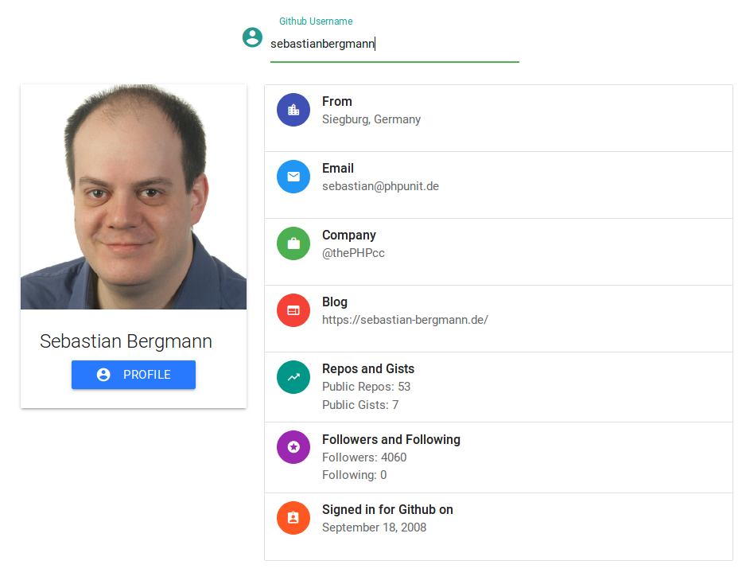

# Github Profile Analyzer with Angular + Spring

A simple profile analyzer for developers.

_Application when ran through Sebestian Bergmann's Github profile_.

## Prerequesits

* Angular-CLI installed. ( You can install it by running ``sudo npm install @angular/cli`` ).
* JDK (Java Development Kit)
* Node.js  (npm)

## Usage

1. Clone the repository using `git clone` (Or any other method i.e. using an IDE) and open the project folder, import the maven dependencies.
2. Enable Auto-import if you are in WebStorm and if you are in Visual Studio Code, there is a handy plugin which I will state [here](https://marketplace.visualstudio.com/items?itemName=georgewfraser.vscode-javac). It will automatically build the application and import the maven dependencies. You can run the program (backend Tomcat server) using F5 (If you're in Visual Studio Code) or just simply pressing Run button (If you're in Webstorm).
3. Install front end dependencies for Angular by running `npm install` in the `/client` folder.
4. Start the front end server by running `ng serve` . Make sure you're in `/client` folder.

_Visual Studio Code Java integration_.

