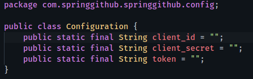

# Github Profile Analyzer with Angular + Spring

A simple profile analyzer for developers. **You can follow a thorough walkthrough through this application by visiting my series of blogposts starting from [this.](https://dasunpubudu.wordpress.com/2018/01/13/creating-a-github-profile-analyzer-with-spring-boot-angular-part-i-introduction/)**

_Application when ran through my Github profile_.

## Prerequesits

* Angular-CLI installed. ( You can install it by running ``sudo npm install -g @angular/cli`` ).
* JDK (Java Development Kit)
* Node.js  (npm)

## Usage

1. Clone the repository using `git clone` (Or any other method i.e. using an IDE) and open the project folder, import the maven dependencies.
2. Enable Auto-import if you are in IntelliJ and if you are in Visual Studio Code, there is a handy plugin which I will state [here](https://marketplace.visualstudio.com/items?itemName=georgewfraser.vscode-javac). It will automatically build the application and import the maven dependencies. You can run the program (backend Tomcat server) using F5 (If you're in Visual Studio Code) or just simply pressing Run button (If you're in Webstorm).
3. Install front end dependencies for Angular by running `npm install` in the `/client` folder.
4. Register an application in [Github](https://github.com/settings/applications/new) and obtain your `client_id` and `client_secret`.

5. Start the front end server by running `ng serve` . Make sure you're in `/client` folder.

6. Create a package called `config` in `com/springgithub/springgithub` directory.

7. Create a `Configuration` class and add these into it.

You must get a personal access token from github.

8. Run the backend Tomcat server from IntelliJ.

9. Open the served front end at port `4200` (Default Angular port).

_Visual Studio Code Java integration_.

